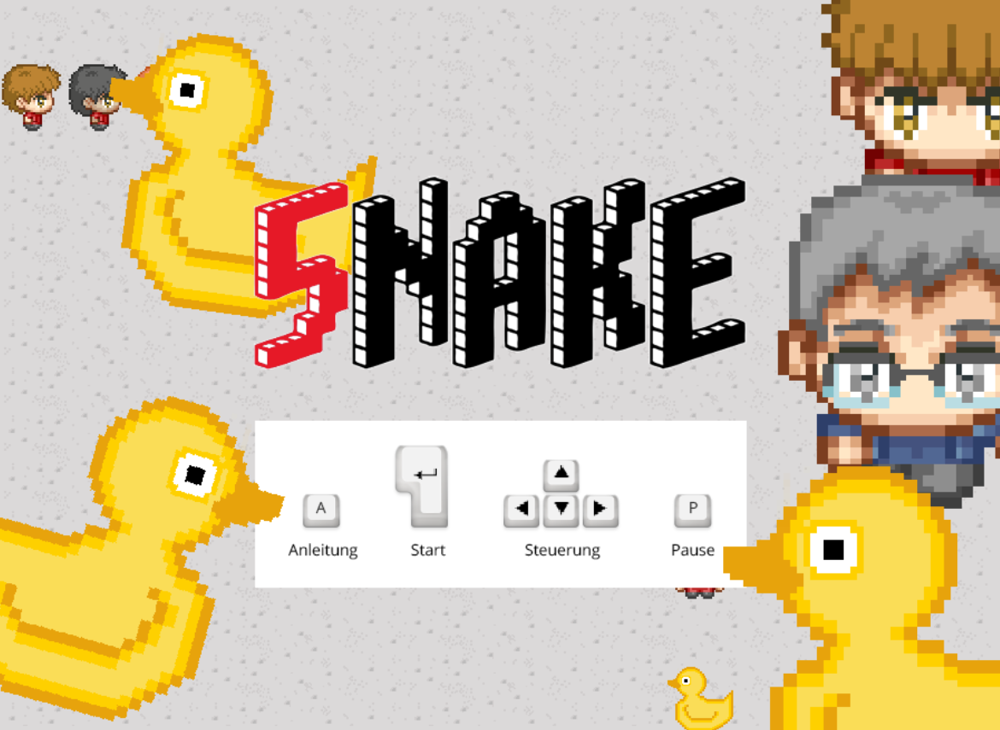
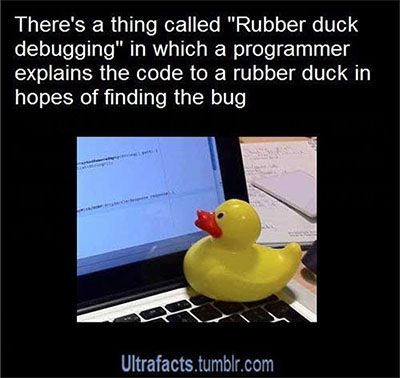

# 5nake
5nake is a 2D web browser game that recreates the old classic Snake game with our own narrative.

## Context
This game was developed for the "Informatics Project 2" module by students of the University of Applied Sciences Duesseldorf.
## Narrative
You play a teacher of the object-oriented programming class. During your break, a bunch of students are following you to ask about solutions for their programming excercise. To get rid of those students you have to give them rubber ducks by collecting those. Some students are standing around, you may better not run into them.

## Used Tools and Assets
The game was developed in ECMAScript 6 using the <a href="https://phaser.io/" target="_blank">Phaser</a> framework.

## Used Assets
### Character design
- <a href="https://opengameart.org/users/sheep" target="_blank">"George" by Radomir Dopieralski</a> was used as reference for the characters.
### Sound design
- <a href="https://opengameart.org/content/a-journey-awaits" target="_blank">"A Journey Awaits" by Pierre Bondoerffer (@pbondoer)</a> was used as paused game soundtrack. 
- <a href="https://opengameart.org/content/opengameartorg-theme-a-better-world" target="_blank">"A Better World" by Trevor Lentz</a> was used as title screen and in-game soundtrack. 

## Documentation
A full documentation can be found here:
- in German (original): <a href="https://www.juliancatnip.de/documents/5nake/5nake_Dokumentation_GER.pdf" target="_blank">5nake_Dokumentation_GER.pdf</a>
- in English (DeepL translated): <a href="https://www.juliancatnip.de/documents/5nake/5nake_Documentation_EN.pdf" target="_blank">5nake_Documentation_EN.pdf</a>
## Playable Version
A playable version can be found on <a href="https://www.nekominto.de/" target="_blank">nekominto.de</a>.

*Note that we did't implement a visualized loading buffer, therefore the screen might be black for a while until the loaded graphics become visible.*
## Controls
The used language in-game is German, for that reason the controls are described here in English as:
- Title screen:
  - A key: Provides an instruction (in German)
    - Enter key: Start the game
  - Enter key: Start the game
  - Arrow keys: Movement
  - P key: Pause the game
- In-game screen:
  - P key: Pause the game
    - Q key: Quit the game
    - Arrow keys: Proceed game
- Game-over screen:
  - Enter key: New game
  - S key: To title screen
